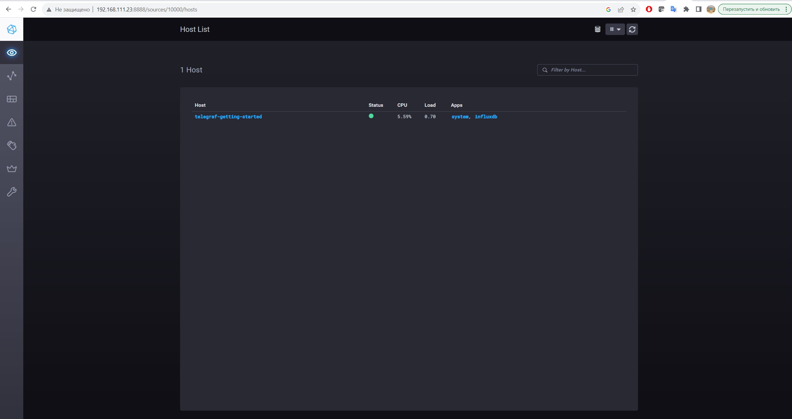
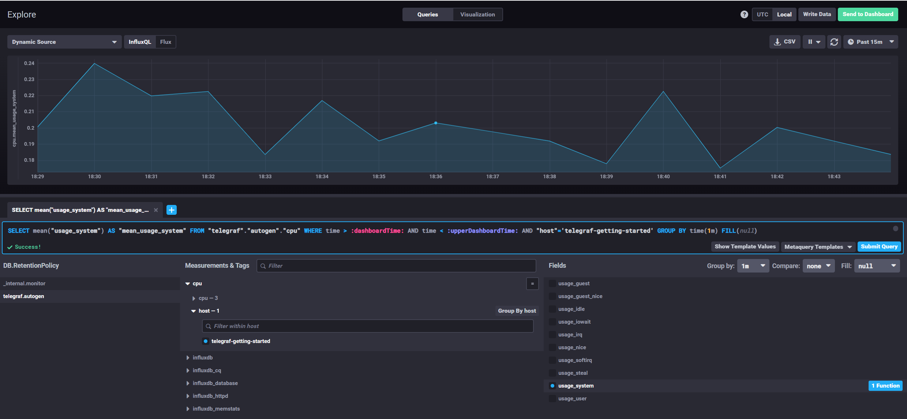
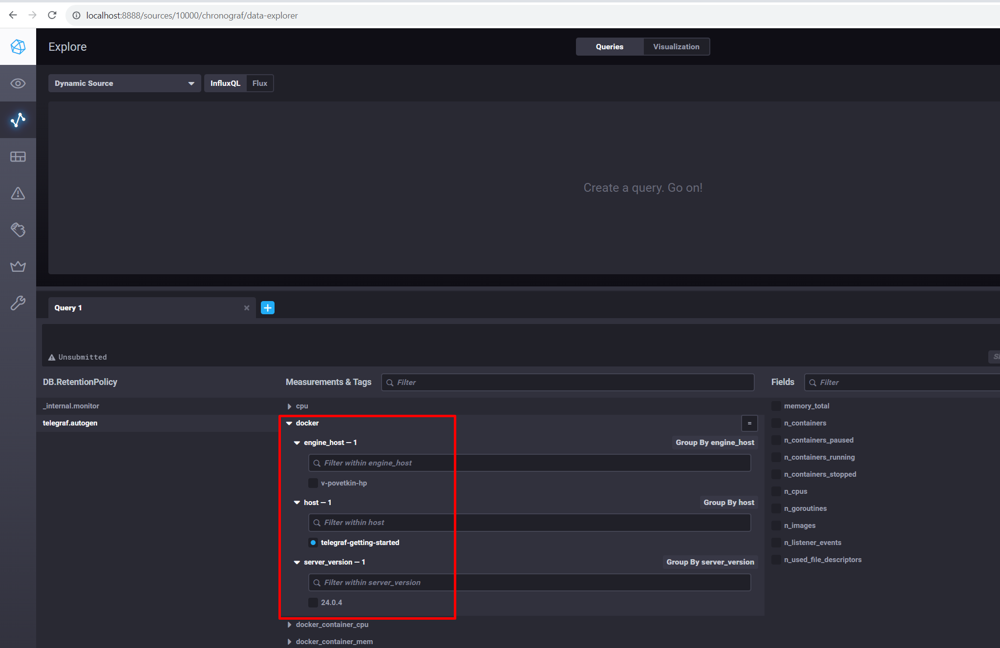

# "13.Системы мониторинга" - Дрибноход Давид

## Обязательные задания

1. Вас пригласили настроить мониторинг на проект. На онбординге вам рассказали, что проект представляет из себя 
платформу для вычислений с выдачей текстовых отчетов, которые сохраняются на диск. Взаимодействие с платформой 
осуществляется по протоколу http. Также вам отметили, что вычисления загружают ЦПУ. Какой минимальный набор метрик вы
выведите в мониторинг и почему?

Ответ:

* CPU Load Average - так как вычисления загружают ЦПУ.
* Статусы HTTP запросов (200 и т.д) для мониторинга web сервиса
* Использование дискового пространства где хранятся отчеты

#
2. Менеджер продукта посмотрев на ваши метрики сказал, что ему непонятно что такое RAM/inodes/CPUla. Также он сказал, 
что хочет понимать, насколько мы выполняем свои обязанности перед клиентами и какое качество обслуживания. Что вы 
можете ему предложить?

Ответ:

* Предложу ввести метрику **SLI**, которая будет отражать качество предоставляемого сервиса.

#
3. Вашей DevOps команде в этом году не выделили финансирование на построение системы сбора логов. Разработчики в свою 
очередь хотят видеть все ошибки, которые выдают их приложения. Какое решение вы можете предпринять в этой ситуации, 
чтобы разработчики получали ошибки приложения?

Ответ:

* Предложу использовать Open Source решение **Sentry** для перехвата возникающих ошибок.

#
4. Вы, как опытный SRE, сделали мониторинг, куда вывели отображения выполнения SLA=99% по http кодам ответов. 
Вычисляете этот параметр по следующей формуле: summ_2xx_requests/summ_all_requests. Данный параметр не поднимается выше 
70%, но при этом в вашей системе нет кодов ответа 5xx и 4xx. Где у вас ошибка?

Ответ:

* В формуле не учтены http-коды 3xx. Она должна выглядеть следующим образом:
* SLI = (summ_2xx_requests + summ_3xx_requests) / (summ_all_requests)

#
5. Опишите основные плюсы и минусы pull и push систем мониторинга.

Ответ:

**PUSH, плюсы**

* Возможность отправки метрик в две и более системы мониторинга (Репликация)
* Обычно используется протокол UDP(меньше накладных расходов)
* Лучше подходит для статической инфраструктуры

**PUSH, минусы**

* Сложная настройка и отладка

**PULL, плюсы**

* Легче получать и отлаживать данные
* Лучше подходит для динамической инфраструктуры
* Централизованная конфигурация

**PULL, минусы**

* Не подходит для "мало-живущих" процессов (Short Lifecycle: JOB, Task ...)
* Тяжело масштабировать

#
6. Какие из ниже перечисленных систем относятся к push модели, а какие к pull? А может есть гибридные?

Ответ:

* Prometheus - **pull**
* TICK - **push**
* Zabbix - **pull и push**
* VictoriaMetrics - **pull и push**
* Nagios - **push**

#
7. Склонируйте себе [репозиторий](https://github.com/influxdata/sandbox/tree/master) и запустите TICK-стэк, 
используя технологии docker и docker-compose.

В виде решения на это упражнение приведите скриншот веб-интерфейса ПО chronograf (`http://localhost:8888`). 

P.S.: если при запуске некоторые контейнеры будут падать с ошибкой - проставьте им режим `Z`, например
`./data:/var/lib:Z`

Ответ:

**Установка**

```
cd /tick
curl -SL https://github.com/docker/compose/releases/download/v2.23.0/docker-compose-linux-x86_64 -o /usr/local/bin/docker-compose
git clone https://github.com/influxdata/sandbox.git
cd sandbox
./sandbox up
```

**TICK UI**



#
8. Перейдите в веб-интерфейс Chronograf (http://localhost:8888) и откройте вкладку Data explorer.
        
    - Нажмите на кнопку Add a query
    - Изучите вывод интерфейса и выберите БД telegraf.autogen
    - В `measurments` выберите cpu->host->telegraf-getting-started, а в `fields` выберите usage_system. Внизу появится график утилизации cpu.
    - Вверху вы можете увидеть запрос, аналогичный SQL-синтаксису. Поэкспериментируйте с запросом, попробуйте изменить группировку и интервал наблюдений.

Для выполнения задания приведите скриншот с отображением метрик утилизации cpu из веб-интерфейса.

Ответ:

**График утилизации CPU**



#
9. Изучите список [telegraf inputs](https://github.com/influxdata/telegraf/tree/master/plugins/inputs). 
Добавьте в конфигурацию telegraf следующий плагин - [docker](https://github.com/influxdata/telegraf/tree/master/plugins/inputs/docker):
```
[[inputs.docker]]
  endpoint = "unix:///var/run/docker.sock"
```

Дополнительно вам может потребоваться донастройка контейнера telegraf в `docker-compose.yml` дополнительного volume и 
режима privileged:
```
  telegraf:
    image: telegraf:1.4.0
    privileged: true
    volumes:
      - ./etc/telegraf.conf:/etc/telegraf/telegraf.conf:Z
      - /var/run/docker.sock:/var/run/docker.sock:Z
    links:
      - influxdb
    ports:
      - "8092:8092/udp"
      - "8094:8094"
      - "8125:8125/udp"
```

После настройке перезапустите telegraf, обновите веб интерфейс и приведите скриншотом список `measurments` в 
веб-интерфейсе базы telegraf.autogen . Там должны появиться метрики, связанные с docker.

Ответ:

**Docker метрики**



